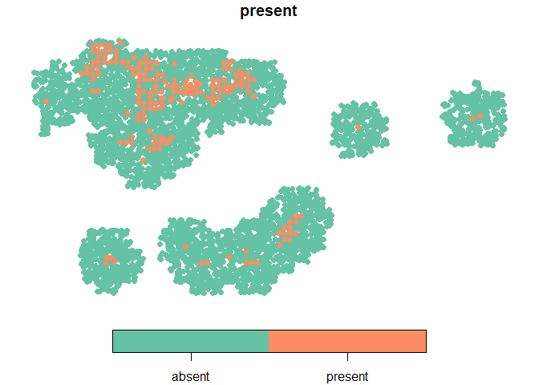
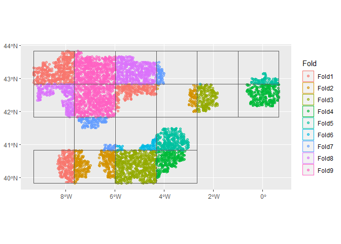
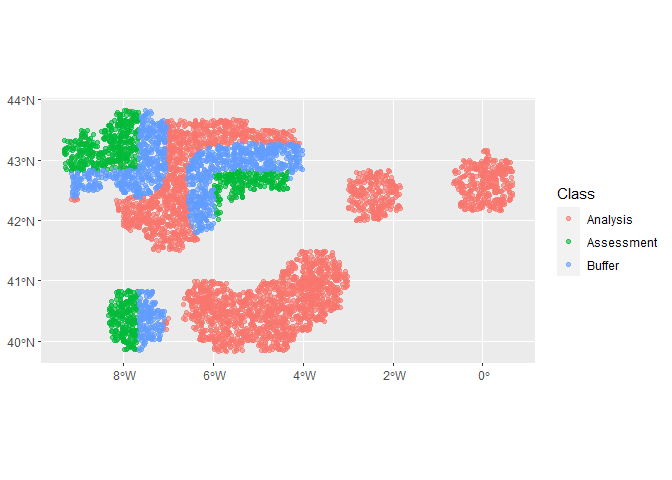
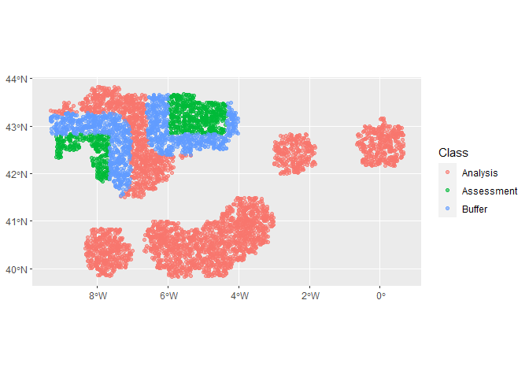
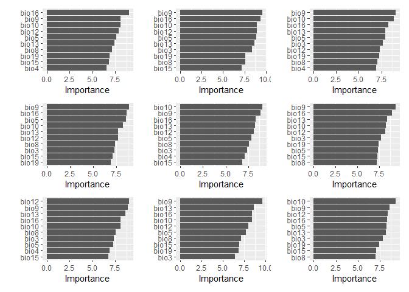
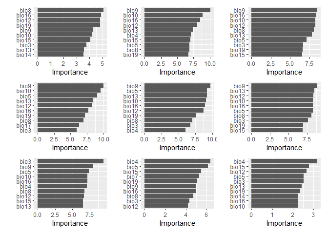

<!-- README.md is generated from README.Rmd. Please edit that file -->

# tidysdm

<!-- badges: start -->

[](https://github.com/rdinnager/tidysdm/actions/workflows/R-CMD-check.yaml)
<!-- badges: end -->

`tidysdm` is a package to make it easy to fit Species Distribution
Models in a `tidymodels` framework.

## Installation

You can install the development version of tidysdm from
[GitHub](https://github.com/) with:

``` r
# install.packages("devtools")
devtools::install_github("rdinnager/tidysdm")
```

## Example

``` r
library(tidysdm)
#> Loading required package: parsnip
#> Loading required package: recipes
#> Loading required package: dplyr
#> 
#> Attaching package: 'dplyr'
#> The following objects are masked from 'package:stats':
#> 
#>     filter, lag
#> The following objects are masked from 'package:base':
#> 
#>     intersect, setdiff, setequal, union
#> 
#> Attaching package: 'recipes'
#> The following object is masked from 'package:stats':
#> 
#>     step
set.seed(112233)
```

We will use data from the `ENMTools` package to demonstrate how
`tidysdm` works.

``` r
library(ENMTools)
#> Loading required package: raster
#> Loading required package: sp
#> 
#> Attaching package: 'raster'
#> The following object is masked from 'package:dplyr':
#> 
#>     select
#> Loading required package: dismo
library(tidyverse)
#> ── Attaching packages
#> ───────────────────────────────────────
#> tidyverse 1.3.2 ──
#> ✔ ggplot2 3.3.6     ✔ purrr   0.3.5
#> ✔ tibble  3.1.8     ✔ stringr 1.4.1
#> ✔ tidyr   1.2.1     ✔ forcats 0.5.2
#> ✔ readr   2.1.3     
#> ── Conflicts ────────────────────────────────────────── tidyverse_conflicts() ──
#> ✖ tidyr::extract() masks raster::extract()
#> ✖ dplyr::filter()  masks stats::filter()
#> ✖ stringr::fixed() masks recipes::fixed()
#> ✖ dplyr::lag()     masks stats::lag()
#> ✖ raster::select() masks dplyr::select()
library(tidymodels)
#> ── Attaching packages ────────────────────────────────────── tidymodels 1.0.0 ──
#> ✔ broom        1.0.1     ✔ tune         1.0.1
#> ✔ dials        1.0.0     ✔ workflows    1.1.0
#> ✔ infer        1.0.3     ✔ workflowsets 1.0.0
#> ✔ modeldata    1.0.1     ✔ yardstick    1.1.0
#> ✔ rsample      1.1.0     
#> ── Conflicts ───────────────────────────────────────── tidymodels_conflicts() ──
#> ✖ scales::discard()  masks purrr::discard()
#> ✖ tidyr::extract()   masks raster::extract()
#> ✖ dplyr::filter()    masks stats::filter()
#> ✖ stringr::fixed()   masks recipes::fixed()
#> ✖ dplyr::lag()       masks stats::lag()
#> ✖ raster::select()   masks dplyr::select()
#> ✖ yardstick::spec()  masks readr::spec()
#> ✖ recipes::step()    masks stats::step()
#> ✖ dials::threshold() masks dismo::threshold()
#> ✖ raster::update()   masks recipes::update(), stats::update()
#> • Use tidymodels_prefer() to resolve common conflicts.
library(spatialsample)
data("iberolacerta.clade")
data("euro.worldclim")
monticola <- iberolacerta.clade$species$monticola
```

We start by generating a {tidymodels} compatable `sf` object for the
species we want to model.

``` r
dat <- sdm_data(monticola$presence.points,
                bg = monticola$range,
                n = 5000,
                coords = c("Longitude",
                           "Latitude"),
                crs = 4326)

dat
#> Simple feature collection with 5260 features and 2 fields
#> Geometry type: POINT
#> Dimension:     XY
#> Bounding box:  xmin: -9.31549 ymin: 39.83402 xmax: 0.6627441 ymax: 43.8299
#> Geodetic CRS:  WGS 84
#> First 10 features:
#>    present pnt_origin                       pnts
#> 1  present       data POINT (-5.171215 43.06957)
#> 2  present       data POINT (-6.036635 43.02531)
#> 3  present       data POINT (-7.679727 40.38852)
#> 4  present       data POINT (-7.790437 40.30959)
#> 5  present       data  POINT (-7.47334 43.78935)
#> 6  present       data  POINT (-6.575039 42.9107)
#> 7  present       data POINT (-5.132756 43.49572)
#> 8  present       data POINT (-7.787378 40.39362)
#> 9  present       data  POINT (-4.941888 43.3531)
#> 10 present       data  POINT (-7.621731 40.3417)

plot(dat %>% 
       dplyr::select(present) %>% 
       arrange(present), 
     pch = 19)
```



Now we can use the `{spatialsample}` package to create spatial cross
validation folds! We will first create a regular cross validation fold
object for comparison. Note that this can take awhile because a spatial
distance is calculated between all points! We are working on a faster
method for pseudo-absence data.

``` r
## regular CV
cv_folds <- vfold_cv(dat, 9)

## spatial CV
cv_folds_spat <- spatial_block_cv(dat, method = "snake",
                             n = c(6, 4),
                             v = 9,
                             buffer = 50000)
cv_folds_spat
#> #  9-fold spatial block cross-validation 
#> # A tibble: 9 × 2
#>   splits              id   
#>   <list>              <chr>
#> 1 <split [3098/902]>  Fold1
#> 2 <split [4056/427]>  Fold2
#> 3 <split [3923/761]>  Fold3
#> 4 <split [4175/517]>  Fold4
#> 5 <split [4408/375]>  Fold5
#> 6 <split [4501/71]>   Fold6
#> 7 <split [4293/210]>  Fold7
#> 8 <split [3346/789]>  Fold8
#> 9 <split [3246/1207]> Fold9

## look at the spatial folds
autoplot(cv_folds_spat)
```



``` r

autoplot(cv_folds_spat$splits[[1]])
```



``` r
autoplot(cv_folds_spat$splits[[8]])
```



Let’s create a recipe to apply some common data processing steps to
prepare for SDM fitting. We start with `step_add_env_vars()`, which is a
`{tidymodels}` function. The rest are standard steps from the
`{recipes}` package. `step_impute_median()` imputes missing values
(since we will be doing a random forest model which cannot handle
missing values). `step_YeoJohnson()` does a Yeo-Johnson transformation
on the predictors, which makes them more symmetric and
‘*Gaussian*-like’. It also saves the parameters used in the
transformation which will be automatically applied to any test data used
for prediction later. Finally `step_normalize()` transforms predictors
to have a mean of zero and a standard deviation of 1, so that they are
all on the same scale. It also saves the means and sds to be applied to
test data. To see the result of the step we run `prep()` and
`bake(new_data = NULL)`.

``` r
sdm_recipe <- recipe(dat) %>%
  step_add_env_vars(env = euro.worldclim) %>%
  step_impute_median(all_predictors()) %>%
  step_YeoJohnson(all_predictors()) %>%
  step_normalize(all_predictors())

test <- prep(sdm_recipe) %>%
  bake(NULL)

test
#> # A tibble: 5,260 × 22
#>    present                 pnts pnt_origin   bio1    bio2   bio3     bio4
#>    <fct>            <POINT [°]> <fct>       <dbl>   <dbl>  <dbl>    <dbl>
#>  1 present (-5.171215 43.06957) data       -1.47   0.167   0.777 -0.332  
#>  2 present (-6.036635 43.02531) data       -1.53   0.167   0.777 -0.336  
#>  3 present (-7.679727 40.38852) data        1.07  -0.332  -0.193 -0.0434 
#>  4 present (-7.790437 40.30959) data        0.645 -0.763  -1.16  -0.0264 
#>  5 present  (-7.47334 43.78935) data        1.23  -1.44    1.76  -1.61   
#>  6 present  (-6.575039 42.9107) data       -1.28   0.0786  0.777 -0.248  
#>  7 present (-5.132756 43.49572) data        0.854 -1.35    1.27  -1.33   
#>  8 present (-7.787378 40.39362) data        1.07  -0.332  -0.193 -0.0434 
#>  9 present  (-4.941888 43.3531) data        0.593 -1.35    0.777 -1.27   
#> 10 present  (-7.621731 40.3417) data       -0.644 -1.44   -2.58   0.00321
#> # … with 5,250 more rows, and 15 more variables: bio5 <dbl>, bio6 <dbl>,
#> #   bio7 <dbl>, bio8 <dbl>, bio9 <dbl>, bio10 <dbl>, bio11 <dbl>, bio12 <dbl>,
#> #   bio13 <dbl>, bio14 <dbl>, bio15 <dbl>, bio16 <dbl>, bio17 <dbl>,
#> #   bio18 <dbl>, bio19 <dbl>
```

Now we can setup a random forest model with `{parsnip}` and combine it
with our recipe using a workflow from the `{workflows}` package..

``` r
mod <- rand_forest() %>%
  set_engine("ranger", importance = "impurity") %>%
  set_mode("classification")

wf <- workflow() %>%
  add_recipe(sdm_recipe) %>%
  add_model(mod,
            formula = present ~ .)

wf
#> ══ Workflow ════════════════════════════════════════════════════════════════════
#> Preprocessor: Recipe
#> Model: rand_forest()
#> 
#> ── Preprocessor ────────────────────────────────────────────────────────────────
#> 4 Recipe Steps
#> 
#> • step_add_env_vars()
#> • step_impute_median()
#> • step_YeoJohnson()
#> • step_normalize()
#> 
#> ── Model ───────────────────────────────────────────────────────────────────────
#> Random Forest Model Specification (classification)
#> 
#> Engine-Specific Arguments:
#>   importance = impurity
#> 
#> Computational engine: ranger
```

Now we fit the model! We will start with the regular cross validation
folds, and use `fit_resamples()` to generate metrics based on the fits
to each of the validation sets in our folds. Then `collect_metrics()`
will calculate the means across folds for us.

``` r
fit_1 <- wf %>%
  fit_resamples(cv_folds, 
                control = control_resamples(extract = extract_fit_engine))

fit_1 %>%
  collect_metrics()
#> # A tibble: 2 × 6
#>   .metric  .estimator  mean     n std_err .config             
#>   <chr>    <chr>      <dbl> <int>   <dbl> <chr>               
#> 1 accuracy binary     0.948     9 0.00311 Preprocessor1_Model1
#> 2 roc_auc  binary     0.824     9 0.0121  Preprocessor1_Model1
```

Okay, so our ROC AUC value is pretty good at around 0.82. Now we do the
same for the spatial cross validation folds.

``` r
fit_2 <- wf %>%
  fit_resamples(cv_folds_spat,
                control = control_resamples(extract = extract_fit_engine))
#> ! Fold6: internal: No control observations were detected in `truth` with control level 'pre...
#> ! Fold7: internal: No control observations were detected in `truth` with control level 'pre...

fit_2 %>%
  collect_metrics()
#> # A tibble: 2 × 6
#>   .metric  .estimator  mean     n std_err .config             
#>   <chr>    <chr>      <dbl> <int>   <dbl> <chr>               
#> 1 accuracy binary     0.968     9  0.0127 Preprocessor1_Model1
#> 2 roc_auc  binary     0.577     7  0.0541 Preprocessor1_Model1
```

Using spatially independent cross validation folds has shown us our
model does much more poorly if we ask it to generalise to spatial areas
not in the training set. Now ROC AUC is only \~ 0.58 – considerably
worse. Looking at the individual folds, there is substantial variation
in the quality of models.

``` r
fit_2$.metrics
#> [[1]]
#> # A tibble: 2 × 4
#>   .metric  .estimator .estimate .config             
#>   <chr>    <chr>          <dbl> <chr>               
#> 1 accuracy binary         0.955 Preprocessor1_Model1
#> 2 roc_auc  binary         0.775 Preprocessor1_Model1
#> 
#> [[2]]
#> # A tibble: 2 × 4
#>   .metric  .estimator .estimate .config             
#>   <chr>    <chr>          <dbl> <chr>               
#> 1 accuracy binary         0.991 Preprocessor1_Model1
#> 2 roc_auc  binary         0.743 Preprocessor1_Model1
#> 
#> [[3]]
#> # A tibble: 2 × 4
#>   .metric  .estimator .estimate .config             
#>   <chr>    <chr>          <dbl> <chr>               
#> 1 accuracy binary         0.989 Preprocessor1_Model1
#> 2 roc_auc  binary         0.503 Preprocessor1_Model1
#> 
#> [[4]]
#> # A tibble: 2 × 4
#>   .metric  .estimator .estimate .config             
#>   <chr>    <chr>          <dbl> <chr>               
#> 1 accuracy binary         0.983 Preprocessor1_Model1
#> 2 roc_auc  binary         0.454 Preprocessor1_Model1
#> 
#> [[5]]
#> # A tibble: 2 × 4
#>   .metric  .estimator .estimate .config             
#>   <chr>    <chr>          <dbl> <chr>               
#> 1 accuracy binary         0.984 Preprocessor1_Model1
#> 2 roc_auc  binary         0.476 Preprocessor1_Model1
#> 
#> [[6]]
#> # A tibble: 2 × 4
#>   .metric  .estimator .estimate .config             
#>   <chr>    <chr>          <dbl> <chr>               
#> 1 accuracy binary             1 Preprocessor1_Model1
#> 2 roc_auc  binary            NA Preprocessor1_Model1
#> 
#> [[7]]
#> # A tibble: 2 × 4
#>   .metric  .estimator .estimate .config             
#>   <chr>    <chr>          <dbl> <chr>               
#> 1 accuracy binary             1 Preprocessor1_Model1
#> 2 roc_auc  binary            NA Preprocessor1_Model1
#> 
#> [[8]]
#> # A tibble: 2 × 4
#>   .metric  .estimator .estimate .config             
#>   <chr>    <chr>          <dbl> <chr>               
#> 1 accuracy binary         0.919 Preprocessor1_Model1
#> 2 roc_auc  binary         0.437 Preprocessor1_Model1
#> 
#> [[9]]
#> # A tibble: 2 × 4
#>   .metric  .estimator .estimate .config             
#>   <chr>    <chr>          <dbl> <chr>               
#> 1 accuracy binary         0.894 Preprocessor1_Model1
#> 2 roc_auc  binary         0.653 Preprocessor1_Model1
```

The first fold the model looks to have done a reasonable job. Which one
was that?

``` r
autoplot(cv_folds_spat$splits[[1]])
```


Let’s have a look at the importance values determined by the random
forest for our variables.

``` r
library(vip)
#> 
#> Attaching package: 'vip'
#> The following object is masked from 'package:utils':
#> 
#>     vi
library(patchwork)
#> 
#> Attaching package: 'patchwork'
#> The following object is masked from 'package:raster':
#> 
#>     area

fit_1 %>%
  unnest(.extracts) %>%
  pull(.extracts) %>%
  map(vip) %>%
  wrap_plots(ncol = 3, nrow = 3)
```



The ordering is reasonably consistent between different folds. Now, the
spatial folds:

``` r
fit_2 %>%
  unnest(.extracts) %>%
  pull(.extracts) %>%
  map(vip) %>%
  wrap_plots(ncol = 3, nrow = 3)
```



There seems to be quite a bit more variation in what variables are
important between different spatial folds. Which is interesting.

We can try and improve the performance of the model on spatially
independent data by using the spatial cross validation folds to tune the
hyperparameters of the model. We can use the `{tune}` package for this.
Using `tune_bayes()` we can use Bayesian optimization to find an optimal
set. What hyperparameters should we tune. For random forest we only have
three, `mtry`, `trees`, and `min_n`. Let’s try tuning all three. First
we make a new model object where we designate these parameters for
tuning, then wrap it into a new workflow.

``` r
mod_tune <- rand_forest(mtry = tune(),
                        trees = tune(),
                        min_n = tune()) %>%
  set_engine("ranger", importance = "impurity") %>%
  set_mode("classification")

wf_tune <- workflow() %>%
  add_recipe(sdm_recipe) %>%
  add_model(mod_tune,
            formula = present ~ .)

wf_tune
#> ══ Workflow ════════════════════════════════════════════════════════════════════
#> Preprocessor: Recipe
#> Model: rand_forest()
#> 
#> ── Preprocessor ────────────────────────────────────────────────────────────────
#> 4 Recipe Steps
#> 
#> • step_add_env_vars()
#> • step_impute_median()
#> • step_YeoJohnson()
#> • step_normalize()
#> 
#> ── Model ───────────────────────────────────────────────────────────────────────
#> Random Forest Model Specification (classification)
#> 
#> Main Arguments:
#>   mtry = tune()
#>   trees = tune()
#>   min_n = tune()
#> 
#> Engine-Specific Arguments:
#>   importance = impurity
#> 
#> Computational engine: ranger
```

Tuning is now as simple as calling `tune_bayes()`. First we set up an
initial set of tuning models using a tuning grid (regularly spaced
values of the hyper-parameters). By the way, this will take awhile. If
you want to do this on your computer I would recommend setting up a
parallel backend for tuning (see
<https://tune.tidymodels.org/articles/extras/optimizations.html>).

``` r
tune_init <- wf_tune %>%
  tune_grid(cv_folds_spat,
            grid = 27,
            control = control_grid(verbose = interactive()))
```

Now this serves as initial values for `tune_bayes()`.

``` r
final_params <- extract_parameter_set_dials(mod_tune) %>%
  finalize(dat)

tuned <- wf_tune %>%
  tune_bayes(cv_folds_spat,
             initial = tune_init,
             iter = 50,
             param_info = final_params,
             control = control_bayes(verbose = interactive(),
                                     no_improve = 50L))
```

``` r
tuned %>%
  show_best()
```

After all that we haven’t much improved the ability of our model to
predict spatially separated testing data sets! This is not that
surprising since random forest generally doesn’t need much tuning. And
ultimately, the problem is not poor hyper-parameters but overfitting to
spatial patterns found in the data. This cannot be prevented except by
finding some way to help the model ‘account’ for spatial autocorrelation
in the data. There are some approaches to doing this, which might help,
but can only go so far. The problem of space is impossible to make go
away completely, at least using statistical methods.

Note that the best solutions had a very low `mtry`. This means the
random forest is only using 1 to 3 variables at a time to make
predictions. This implies all variable contain mostly the same amount of
information and don’t interact much, suggesting that these climate
predictors have little to do with the species distribution, each is
mainly being used for their spatial information. The best bet here, as
in most cases is to find better predictors that are more definitely
related to the species’ known ecology!

Lastly, `{tidysdm}` makes it easy to generate visualizable predictions
on the original landscape using the `create_prediction_grid()` function,
which creates a grid of x and y values, optionally with a polygon
attached to help with plotting. Feeding this to the `augment` function
will automatically make predictions based on the model and the bind
those prediction back to the prediction grid data, ready for plotting.
We will make hexagons which look much cooler than squares (just use
`square = FALSE`).

``` r
pred_grid <- create_prediction_grid(bg = monticola$range, n = 2500, square = FALSE, include_polygons = TRUE)
plot(pred_grid$polygon)
```

Now to make the predictions we first do a final fit of our random forest
model on the full data set, and using the best hyper-parameters from our
spatial cross validation.

``` r
final_fit <- wf_tune %>%
  finalize_workflow(select_best(tuned)) %>%
  fit(dat)
final_fit
```

``` r
## Does not work yet
pred_grid_preds <- final_fit %>%
  augment(pred_grid)
 
```
